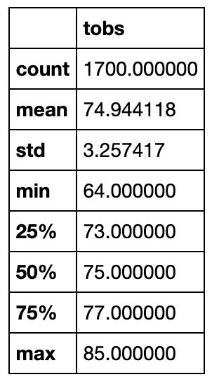
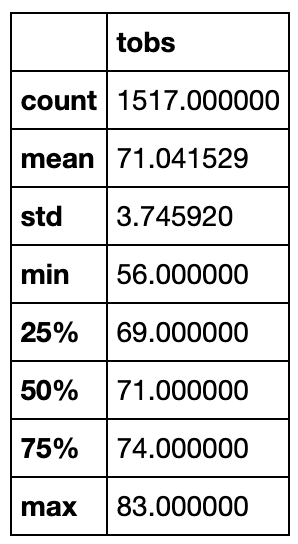
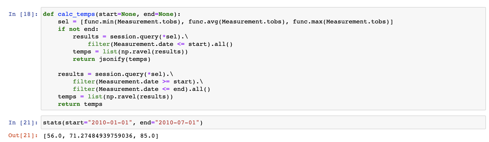
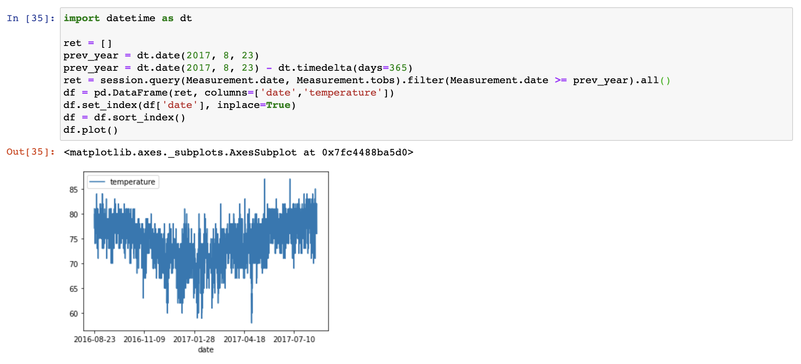

# Surfs Up Challenge

# Overview
The goal of this project is to perform weather analysis and to extract temperature data for the stakeholders in starting Surf n' Shake shop. The code written in Python uses SQLAlchemy and Object Relational Mapper to filter the data from SQLite database.

# Results
The following results show the three key differences in weather between June and December:

   June Temperature Stats                   |        December Temperature Stats
:------------------------------------------:|:--------------------------------------------:
                |        

- It can be observed from the above table that the difference between average temperatures for the month of June and December is only 3 degrees.
- Second observation from the above stats is that the max temperature reaches to 85 degress Farenheit in the month of June, whereas, in the month of December, it reaches to 83 degrees which shows that there is not much difference between the maximum temperatures for the summer and winter seasons.
- Additionally we can also see that temperature variability is also not much and standard deviation 
between the two months is not dispersing from the mean a lot.
# Summary
From the analysis of the results we can safely conclude that surf and ice cream business should be sustainable in the winter months as well since there is not a drastic change in highest temperature. Also since most of the time between the months of June till December, the temperatures are in the 70's, therefore the business can be run smoothly.

In addition to the above analysis, following queries can be run to further analyze the temperatures at any point of the year:

### Function to retrieve Min, Avg and Max Temperature for any given Start and End date:

### Plot showing Temperature Data for entire year (2016-2017 in the following example):

